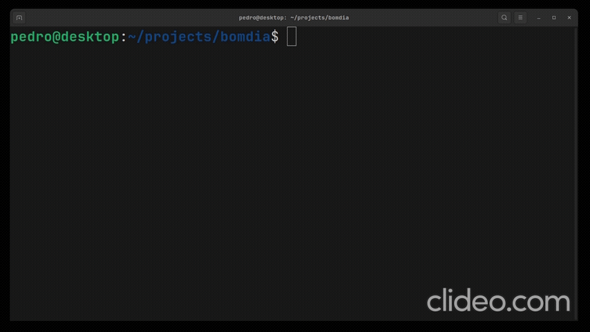
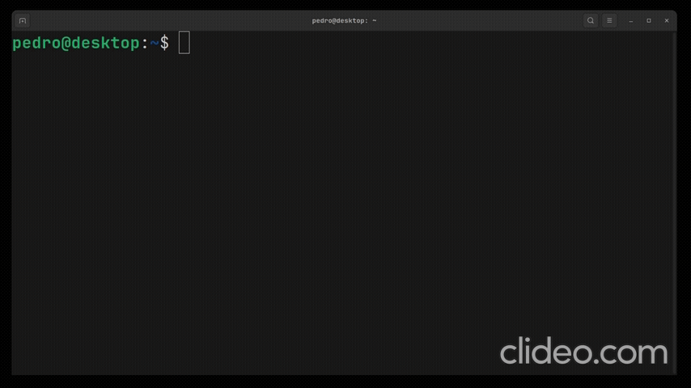

# bomdia CLI

CLI para o trabalho de Linguagem de Programação I



## Rodando a CLI



### Node.js

Pra executar o arquivo javascript podemos simplesmente rodar

```bash
node index.js <option>
```

### Executável

A lib utilizada para fazer o build foi https://github.com/nexe/nexe

Para fazer o build da CLI, podemos rodar

Usando NPM

```bash
npx nexe --build
npx nexe -t x86-8.0.0
```

Usando PNPM (mais rápido)

```bash
pnpm dlx nexe --build
pnpm dlx nexe -t x86-8.0.0
```
